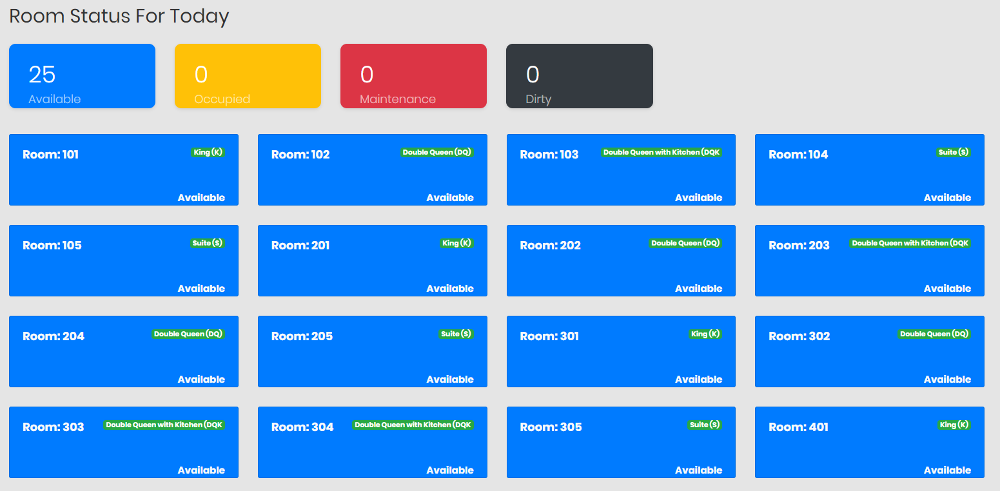
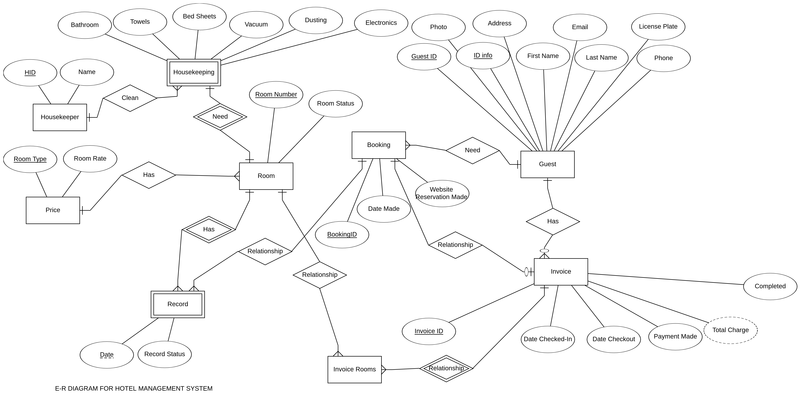

# Intro
The web app will handle most of the functionality for the Front Desk staff, including the following capabilities:
- Capability 1: Screen that shows all rooms and their current status.
- Capability 2: Screen showing a list of the rooms and who is staying in the room for each day for the next 7 days. 
- Capability 3: A reservation screen showing a list of all reservations currently in the system
- Capability 4: A housekeeping screen to manage housekeeping
- Capability 5: A guest profile screen to show guest information
- Capability 6: Current stay screen showing a guest’s information for their current stay.
- Capability 7: A search screen to search for guests
- Capability 8: A daily report screen

# Demo

[Link](http://dannyapp.site)

# Database details

# How to run:
These steps were tested on Ubuntu, so if you use other OS, you can find another command to replace
1. Install docker:
$ sudo apt update
$ sudo apt install apt-transport-https ca-certificates curl software-properties-common
$ curl -fsSL https://download.docker.com/linux/ubuntu/gpg | sudo apt-key add -
$ sudo add-apt-repository "deb [arch=amd64] https://download.docker.com/linux/ubuntu bionic stable"
$ sudo apt update
$ apt-cache policy docker-ce
$ sudo apt install docker-ce
$ sudo systemctl status docker
$ sudo apt install docker-compose

2. After install dockers:
Open terminal in folder downloaded from github
$ sudo docker-compose up
Check if they are running:
$ docker container ls -a
If you Want to down service to re-run scripts to re-create database:
$ sudo docker-compose down -v
$ sudo docker-compose up

Server mysql after running dockers:
link web: http://localhost/
phpmyadmin: http://localhost:8082/
	user root
	pass root

Access database in docker:
	$host = 'mysql';	// is shown in the container ($docker container ls -a)
	$user = getenv('MYSQL_USER'); // save in hidden file 'env'
	$pass = getenv('MYSQL_PASSWORD'); // save in hidden file 'env'
	$conn = mysqli_connect($host, $user, $pass, 'any_database_name');

